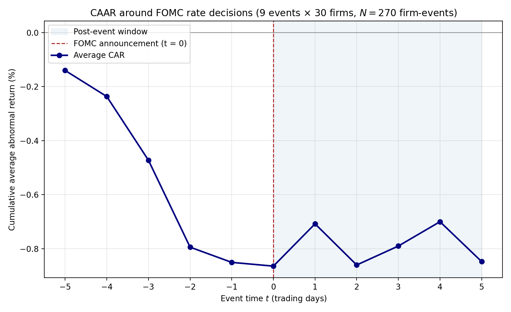
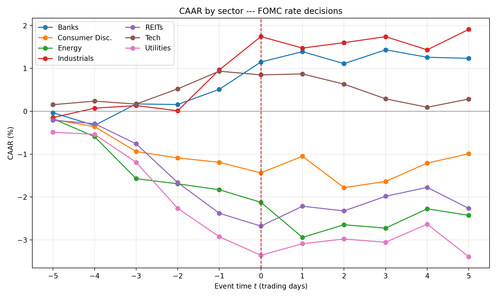

# FOMC-event-study


> **Does the US large-cap equity market price FOMC rate decisions efficiently?**
> Event study of 30 firms across seven sectors × 9 FOMC rate-change announcements
> from March 2022 through December 2025 (270 firm-event observations), with a
> Fama–French 3-factor expected-return benchmark, a hike-vs-cut split, sector-level
> t-tests, and an event-clustered bootstrap. Pooled CAAR is statistically zero in
> every test window. The cross-section is not — banks gain a significant +1.23 %
> in [−1, +1] (t = +3.41, p = 0.001) and utilities lose a significant −0.83 %
> (t = −3.28, p = 0.002). Three implementations: Python primary, R port, SAS port.

<p align="center">
  
</p>

## TL;DR

|                              | Estimate     | t       | p       |
|------------------------------|-------------:|--------:|--------:|
| Pooled CAR, [−1, +1] window  | +0.086 %     | +0.523  | 0.601   |
| Pooled CAR, [0, +1] window   | +0.143 %     | +1.097  | 0.273   |
| Pooled CAR, [0, +5] window   | +0.003 %     | +0.013  | 0.989   |
| Banks, [−1, +1] window       | **+1.233 %** | **+3.41** | **0.001** |
| Utilities, [−1, +1] window   | **−0.826 %** | **−3.28** | **0.002** |
| Bootstrap 95 % CI on [0, +5] | [−0.55 %, +0.42 %] | | |

Pooled CAAR drifts to roughly −0.85 % by the announcement day, then sits there.
Almost all of the drift is realised between *t* = −5 and *t* = −2, before the
announcement; from *t* = −1 onward the trajectory is flat. The pattern is
consistent with semi-strong-form market efficiency at the aggregate level. But
the pooled null hides a sharp cross-sectional pattern: banks and utilities both
reject zero at the 1 % level in the immediate window, and the cross-sectional
spread of mean CAR is an order of magnitude larger than the pooled mean. A
market-wide event study tests a particular kind of efficiency; it is silent on
cross-sectional predictability, and the FOMC sample examined here is a clean
illustration of the distinction.

The result survives:
- splitting the sample by direction (hikes vs cuts) — neither subsample rejects zero
- an event-clustered bootstrap (2 000 replications, resampling whole events with
  replacement) — bootstrap SE is 18 % wider than the naive i.i.d. SE, but the
  95 % CI still solidly contains zero

## Quickstart

```bash
git clone https://github.com/Guannings/fomc-event-study.git
cd fomc-event-study
pip install -r requirements.txt
python event_study.py
```

Runtime is about 2 minutes (most of it is the 2 000-replication bootstrap on
the [0, +5] window). All outputs land in `./results/`, overwriting the files
already shipped with the repo.

Reproducibility is exact up to floating-point precision: bootstrap seed is
fixed (`np.random.seed(42)`), the FOMC event dates are hardcoded, the firm list
is hardcoded, and the data window is closed on both ends.

## What's in this repo

| File | Purpose |
|---|---|
| `event_study.py`           | Primary Python implementation. Pulls prices, runs the 270 FF3 regressions, computes CAR/CAAR, runs t-tests, executes the three robustness blocks, generates the plots. |
| `event_study.R`            | R port with the same statistical output. Uses `quantmod` for prices, base `lm.fit()` for regressions, `data.table` for the panel, `ggplot2` for plots. |
| `event_study.sas`          | SAS port. SAS has no native Yahoo/Ken French API, so the workflow is two-step: dump `prices.csv` and `ff3.csv` from Python or R first, then SAS reads them. The estimation uses `PROC REG` inside a macro loop over 270 (firm × event) pairs. |
| `paper.pdf`                | Full 18-page writeup. Methodology, tables of results, robustness section, discussion, conclusion, references. |
| `results/`                 | Generated outputs (see table below). |
| `requirements.txt`         | Python deps. Pinned to working versions. |

`results/` contents:

| File | Contents |
|---|---|
| `betas.csv`                | Per (firm, event) α + 3 β estimates + R². 270 rows. |
| `aar_caar_by_t.csv`        | Average abnormal return and cumulative average abnormal return by event-time *t* (11 rows from −5 to +5). |
| `car_per_firm_event.csv`   | Firm-event CAR for each of the three test windows. 270 rows × 3 windows. |
| `test_results.csv`         | Pooled one-sample t-tests for the three headline windows. |
| `split_hike_cut.csv`       | Pooled t-tests separately for the four hikes and the five cuts. |
| `sector_ttests.csv`        | Sector-level one-sample t-tests by window. |
| `bootstrap_ci_0_5.csv`     | Event-clustered bootstrap 95 % CI for the [0, +5] window. |
| `caar_plot.png`            | Main CAAR-trajectory plot (the one in the paper). |
| `caar_by_sector.png`       | Sector breakdown of CAAR over the event window. |

## Method

### Sample

Thirty US-listed, large-capitalisation firms hand-picked to span the
cross-section of theoretical interest-rate sensitivity:

| Sector (n) | Hypothesis on AR following a hike | Tickers |
|---|---|---|
| Banks (6)            | AR > 0 (net interest margin) | JPM, BAC, WFC, C, GS, MS |
| REITs (6)            | AR < 0 (bond proxy)           | O, SPG, PLD, EQIX, AMT, WELL |
| Utilities (5)        | AR < 0 (bond proxy)           | NEE, DUK, SO, AEP, EXC |
| Tech (6)             | AR < 0 (long duration)        | AAPL, MSFT, GOOGL, AMZN, NVDA, META |
| Consumer Disc. (3)   | AR < 0                         | HD, NKE, SBUX |
| Industrials (2)      | AR ≲ 0                         | CAT, DE |
| Energy (2)           | control (weak link)            | XOM, CVX |

For rate cuts the predicted signs reverse.

### Events

Nine FOMC target-rate change announcements, verified from
[federalreserve.gov/monetarypolicy/openmarket.htm](https://www.federalreserve.gov/monetarypolicy/openmarket.htm):

| Date (t = 0) | Action | Notes |
|---|---|---|
| 2022-03-17 | +25 bp | First hike of the post-COVID cycle |
| 2022-06-16 | +75 bp | First +75 bp move since 1994 |
| 2022-09-22 | +75 bp | Hawkish surprise; hot prior-week CPI |
| 2023-03-23 | +25 bp | Hike during the SVB / regional-bank stress |
| 2024-09-19 | −50 bp | First cut of the cycle; market pricing split |
| 2024-12-19 | −25 bp | "Hawkish cut" (dot-plot shock) |
| 2025-09-18 | −25 bp | Opening cut of the 2025 easing cadence |
| 2025-10-30 | −25 bp | Continuation cut |
| 2025-12-11 | −25 bp | Final cut before extended pause |

Four hikes, five cuts. The sample spans the full hiking cycle of 2022–2023,
the September 2024 pivot, and the 2025 easing cadence.

### Factor model and event windows

For each (firm *i*, event *e*) pair, factor loadings are estimated by OLS on
the trading-day window τ ∈ [−250, −30] relative to the event day t = 0:

$$R_{i,\tau} - RF_\tau = \alpha_{i,e} + \beta^{MKT}_{i,e}\,(MKT - RF)_\tau + \beta^{SMB}_{i,e}\,SMB_\tau + \beta^{HML}_{i,e}\,HML_\tau + \varepsilon_{i,\tau}$$

That gives roughly one calendar year of returns, ending one calendar month
before the event so the window is not contaminated by pre-event drift or
leakage. With 30 firms × 9 events = 270 (firm, event) pairs, the procedure
runs 270 separate OLS regressions.

Expected returns on the event window [−5, +5] are then constructed by applying
the estimated betas to the event-window factor realisations:

$$\widehat{E[R_{i,t}]} = RF_t + \hat\alpha_{i,e} + \hat\beta^{MKT}_{i,e}\,(MKT - RF)_t + \hat\beta^{SMB}_{i,e}\,SMB_t + \hat\beta^{HML}_{i,e}\,HML_t$$

Abnormal returns and cumulative abnormal returns follow as
AR<sub>i,t</sub> = R<sub>i,t</sub> − Ê[R<sub>i,t</sub>] and
CAR<sub>i</sub>(τ₁, τ₂) = Σ AR<sub>i,t</sub> over t ∈ [τ₁, τ₂].

### Test windows

Three windows are reported, each satisfying the requirement that it contain
the event day plus a post-event period: [−1, +1] for the immediate reaction,
[0, +1] for the announcement day plus one, and [0, +5] for the delayed
reaction or drift. A Bonferroni correction across the three windows would set
the per-test level at α = 1.67 %; the qualitative conclusions do not depend
on which level is used.

### Data sources

- **Prices**: Yahoo Finance via `yfinance`. Daily adjusted close from
  2021-01-01 through 2026-06-13. The early start gives ~250 trading days of
  history before the first event for the estimation window.
- **Factors**: [Kenneth French's Data Library](https://mba.tuck.dartmouth.edu/pages/faculty/ken.french/data_library.html)
  at Dartmouth Tuck. Daily research factors (Mkt-RF, SMB, HML, RF). The factor
  series is published in **percent** and is divided by 100 before merging with
  returns — forgetting this conversion is a frequent source of error in
  event-study replications.
- **FOMC dates**: Federal Reserve Board's Open Market Operations history.

## Results

### Aggregate CAAR trajectory

Median R² across the 270 regressions is 0.430 (range ~0.10 for energy names
to ~0.80 for the largest banks), comfortably within the typical range for
FF3 on US large-cap equities.

The pooled CAAR drifts from ≈ −0.14 % at t = −5 down to ≈ −0.85 % at t = 0,
with the bulk of the decline concentrated in the [−3, −2] window (combined
AAR ≈ −0.56 %). From t = −1 onward the trajectory is flat. None of the three
test windows rejects the null:

```
Window     Mean CAR (%)   Std (%)    t-stat     p      N
[-1, +1]      +0.086       2.71      +0.523   0.601    270
[ 0, +1]      +0.143       2.14      +1.097   0.273    270
[ 0, +5]      +0.003       3.51      +0.013   0.989    270
```

### Sector-level t-tests

The pooled null hides the more interesting result. Sector-mean CARs:

```
                       [-1, +1]            [0, +1]             [0, +5]
                  Mean    t      p     Mean    t      p     Mean    t      p
Banks         +1.233***  +3.41 0.001  +0.879***  +3.05 0.004  +0.722*   +1.98 0.053
Industrials   +1.462*    +1.83 0.085  +0.509     +0.93 0.367  +0.944    +0.94 0.362
Tech          +0.348     +0.80 0.425  -0.064     -0.18 0.858  -0.648    -1.16 0.250
Consumer D.   +0.039     +0.07 0.943  +0.141     +0.36 0.723  +0.199    +0.28 0.784
REITs         -0.552*    -1.97 0.054  +0.164     +0.64 0.524  +0.113    +0.24 0.812
Utilities     -0.826***  -3.28 0.002  -0.162     -0.78 0.439  -0.465    -0.92 0.360
Energy        -1.249*    -1.98 0.064  -1.110*    -2.01 0.061  -0.597    -0.83 0.419
```

Stars: \*\*\* p < 0.01, \*\* p < 0.05, \* p < 0.10.

The two sectors at the extremes of the rate-sensitivity hypothesis both
reject the null at the 1 % level in the [−1, +1] window, and both survive
any reasonable multiple-comparison correction. At longer horizons the
sector effects attenuate as the differential reaction is absorbed back into
the index.

### Hike vs cut subsamples

The result survives splitting by direction. Neither the four hikes nor the
five cuts rejects the null in any test window:

```
Subsample           Window     Mean CAR (%)   t      p      N
Hikes (N_e = 4)     [-1, +1]      +0.178    +0.72  0.474   120
                    [0, +1]       +0.078    +0.40  0.692   120
                    [0, +5]       -0.280    -0.77  0.443   120
Cuts  (N_e = 5)     [-1, +1]      +0.013    +0.06  0.953   150
                    [0, +1]       +0.194    +1.12  0.265   150
                    [0, +5]       +0.229    +0.91  0.365   150
```

The hike subsample's [0, +5] is mildly negative (−0.28 %) and the cut
subsample's is mildly positive (+0.23 %), directionally consistent with
the theoretical signs being opposite, but both are statistically zero.

### Bootstrap-by-event robustness

The t-tests above assume independent firm-event observations, but firms on
the same announcement day share a common shock. The [0, +5] window is
re-tested using a non-parametric bootstrap that resamples whole events
with replacement (2 000 replications):

```
Point estimate:           +0.003 %
Bootstrap 95 % CI:        [-0.55 %, +0.42 %]
Bootstrap SE (clustered):  0.253 %
Naive (i.i.d.) SE:         0.214 %
SE inflation factor:       1.18 x
```

The event-clustered SE is 18 % larger than the naive SE, but the
confidence interval still solidly contains zero. The non-finding is not
an artefact of ignoring within-event cross-sectional correlation.

## Sector breakdown plot

<p align="center">
  
</p>

Banks and Industrials drift upward; Utilities, REITs, and Energy drift
downward; Technology and Consumer Discretionary are approximately flat. The
spread between the most positive and most negative sector means in the
[0, +5] window is about 1.5 percentage points, an order of magnitude larger
than the pooled mean.

## Sample output

```
$ python event_study.py
Downloading Fama-French factors from Ken French Data Library...
  Loaded FF3: 1926-07-01 -> 2026-04-30 (26233 rows)
Downloading 30 tickers from Yahoo Finance...
  Loaded prices: 2021-01-04 -> 2026-06-12 (1367 rows, 30 tickers)

Running 270 FF3 estimations + event-window AR computations...
  Successful regressions: 270 / 270 (skipped 0)
  Median R^2: 0.430
  Pooled firm-events used in AAR/CAAR: 270

CAAR trajectory (in percent):
       AAR    CAAR
t
-5 -0.1403 -0.1403
-4 -0.0964 -0.2367
-3 -0.2358 -0.4725
-2 -0.3218 -0.7943
-1 -0.0563 -0.8507
 0 -0.0139 -0.8646
 1  0.1565 -0.7080
 2 -0.1523 -0.8603
 3  0.0702 -0.7902
 4  0.0901 -0.7001
 5 -0.1477 -0.8478

Headline t-tests:
  Window [-1, +1]:  mean CAR = +0.0863%  t = +0.523  p = 0.6014  N = 270
  Window [+0, +1]:  mean CAR = +0.1427%  t = +1.097  p = 0.2735  N = 270
  Window [+0, +5]:  mean CAR = +0.0028%  t = +0.013  p = 0.9894  N = 270

Hike vs cut split:
  hike  [-1, +1]:  mean CAR = +0.1780%  t = +0.719  p = 0.4736  N = 120 (events = 4)
  hike  [+0, +1]:  mean CAR = +0.0781%  t = +0.397  p = 0.6921  N = 120 (events = 4)
  hike  [+0, +5]:  mean CAR = -0.2797%  t = -0.770  p = 0.4427  N = 120 (events = 4)
  cut   [-1, +1]:  mean CAR = +0.0130%  t = +0.059  p = 0.9534  N = 150 (events = 5)
  cut   [+0, +1]:  mean CAR = +0.1943%  t = +1.119  p = 0.2650  N = 150 (events = 5)
  cut   [+0, +5]:  mean CAR = +0.2289%  t = +0.908  p = 0.3652  N = 150 (events = 5)

Sector-level t-tests:
  [-1,+1] Industrials        mean = +1.462%  t = +1.826  p = 0.0854  N = 18 *
  [-1,+1] Banks              mean = +1.233%  t = +3.411  p = 0.0012  N = 54 ***
  [-1,+1] Tech               mean = +0.348%  t = +0.804  p = 0.4248  N = 54
  [-1,+1] Consumer Disc.     mean = +0.039%  t = +0.073  p = 0.9425  N = 27
  [-1,+1] REITs              mean = -0.552%  t = -1.970  p = 0.0541  N = 54 *
  [-1,+1] Utilities          mean = -0.826%  t = -3.278  p = 0.0020  N = 45 ***
  [-1,+1] Energy             mean = -1.249%  t = -1.981  p = 0.0640  N = 18 *

Bootstrap-by-event CI for [0, +5] CAR (2000 replications):
  Point estimate:              +0.0028%
  Bootstrap 95% CI:            [-0.5471%, +0.4228%]
  Bootstrap (clustered) SE:    0.2525%
  Naive (i.i.d.) SE:           0.2138%
  Inflation factor:            1.18x

Done. All outputs in /…/results/
```

## Multi-language ports

Python is the primary implementation. R and SAS ports are byte-equivalent on
the numbers up to floating-point precision (and bootstrap noise, since the
bootstrap RNG is not portable across languages).

### R

Uses `quantmod` for Yahoo Finance prices, base `lm.fit()` for the 270
regressions, `data.table` for the panel manipulation, and `ggplot2` for the
plots.

```bash
Rscript event_study.R
```

Install dependencies once with
`install.packages(c("quantmod", "data.table", "ggplot2", "scales"))`.

### SAS

SAS has no native Yahoo Finance or Ken French API, so the workflow is
two-step: dump `prices.csv` and `ff3.csv` from the Python run first, then
run the SAS script. Estimation uses `PROC REG` inside a macro loop over the
270 (firm × event) pairs; t-tests use `PROC TTEST`; plots use `PROC SGPLOT`.

```sas
%let work_dir = /path/to/fomc-event-study;
%include "&work_dir./event_study.sas";
```

Edit the `%let work_dir = ...` line at the top of `event_study.sas` to point
at the repo root before running.

## Caveats and known limitations

These are documented as a longer discussion in §5 of `paper.pdf`; the short
version:

- **Sample is nine events.** A minimum-detectable-effect calculation at
  80 % power and the observed cross-sectional standard deviations puts the
  pooled tests' detection threshold at roughly 40 to 60 basis points, depending
  on the window. The interpretation that prices fully impound the policy news
  is an inference from non-rejection, not from a tight bound around zero. A
  larger event sample would tighten the bound.
- **Surprise component not extracted.** All rate changes are treated
  symmetrically. Following Kuttner (2001), a Fed-funds-futures-derived
  surprise measure would let the specification regress AR on the policy
  surprise itself — a meaningfully cleaner test of informational efficiency.
- **Market-wide event caveat.** The market factor MKT − RF reacts to the
  FOMC announcement itself, so part of the systematic Fed-news impact is
  absorbed into the regression rather than surviving into AR. What's left in
  AR is the *differential* reaction relative to the FF3 benchmark — exactly
  the right quantity for the cross-sectional analysis, but the pooled CAAR
  should not be read as the absolute equity-market response to Fed news.
- **Energy is reframed as a confound, not a control.** The energy reaction
  is strongly negative across most windows. The likely explanation is that the
  pooled sample includes dovish moves in 2024 and 2025 that coincided with
  commodity-price weakness for the specific energy names — not that energy is
  rate-sensitive.
- **Survivorship bias.** All 30 firms were continuously listed through
  2021–2026 by construction. Going back to pre-2008 would make this worse
  (META was 2012, GOOG was 2004); the 2022–2025 cycle is the longest window
  where the current sample composition is consistent throughout.

## Future work

- Hike-vs-cut analysis is structurally limited by the four-hike sample.
  Extending the window back through the 2015–2018 Yellen cycle and the
  2019 cuts would put the directional comparison on a real footing.
- Kuttner-style surprise decomposition using Fed-funds-futures.
- High-frequency intraday version: 30-minute equity reactions to the
  14:00 ET statement release, which would identify the immediate
  market-wide response without the differential-reaction absorption.

## License

[MIT](LICENSE).

====================================================================================

# Disclaimer and Terms of Use

**1. Educational Purpose Only**

This software is for educational and research purposes only and was developed
as a final project for an Investments course by PARVAUX, a Public Finance and Economics double
major at National Chengchi University (NCCU). It is not intended to be a
source of financial advice, and the author is not a registered financial
advisor or licensed securities professional. The event-study methodology
implemented here — Fama–French 3-factor expected returns, OLS estimation
windows, cumulative abnormal returns, one-sample t-tests, sector splits, and
event-clustered bootstrapping — is a demonstration of standard empirical
asset-pricing techniques and should not be construed as a recommendation to
buy, sell, hold, or short any specific security or sector.

**2. No Financial Advice**

Nothing in this repository constitutes professional financial, legal, or tax
advice. Investment decisions should be made based on your own research and
consultation with a qualified financial professional in your jurisdiction.
The empirical findings reported here — that the pooled CAAR around FOMC
rate-change announcements is statistically zero, that the cross-section is
not, that banks gain on hikes and utilities lose — are properties of a
specific 2022–2025 sample under a specific factor-model specification and
do not generalise without further work.

**3. Statistical Caveats**

- A non-rejection of the null is not evidence that the null is true. The
  pooled tests have limited power against effects smaller than ~40–60 bp.
- Cross-sectional t-tests assume independent observations across firms and
  events. Firms on the same announcement day share a common shock; the
  event-clustered bootstrap reported here addresses this for the [0, +5]
  window but not for the others.
- The Fama–French three-factor model captures market, size, and value
  exposures but not momentum, profitability, investment, or liquidity. Any
  systematic factor exposure not in the model contaminates the abnormal
  returns.
- The FOMC sample combines hikes and cuts. The hike-vs-cut split confirms
  the qualitative conclusion in this sample, but cycle composition matters
  for any claim about a "typical" FOMC reaction.

**4. Data Provider Reliability**

The author has no affiliation with Yahoo Finance, Kenneth French, the
Federal Reserve Board, or any other data provider cited above and assumes
no responsibility for outages, incorrect data, API breaking changes, or
rate-limit denials originating from those services. The `yfinance` library
is a third-party wrapper around Yahoo Finance's unofficial endpoints and
may break at any time; Kenneth French's research factors are updated on a
schedule the author does not control.

**5. "AS-IS" SOFTWARE WARRANTY**

**THIS SOFTWARE IS PROVIDED "AS IS", WITHOUT WARRANTY OF ANY KIND, EXPRESS
OR IMPLIED, INCLUDING BUT NOT LIMITED TO THE WARRANTIES OF MERCHANTABILITY,
FITNESS FOR A PARTICULAR PURPOSE, AND NON-INFRINGEMENT. IN NO EVENT SHALL
THE AUTHOR OR COPYRIGHT HOLDER BE LIABLE FOR ANY CLAIM, DAMAGES, OR OTHER
LIABILITY, WHETHER IN AN ACTION OF CONTRACT, TORT, OR OTHERWISE, ARISING
FROM, OUT OF, OR IN CONNECTION WITH THE SOFTWARE OR THE USE OR OTHER
DEALINGS IN THE SOFTWARE.**

**BY USING THIS SOFTWARE, YOU AGREE TO ASSUME ALL RISKS ASSOCIATED WITH
YOUR INVESTMENT, RESEARCH, OR REPLICATION DECISIONS, RELEASING THE AUTHOR
(PARVAUX) FROM ANY LIABILITY REGARDING YOUR FINANCIAL OUTCOMES OR ACADEMIC
USES OF THE METHODS, FINDINGS, OR CODE PRESENTED.**

====================================================================================
